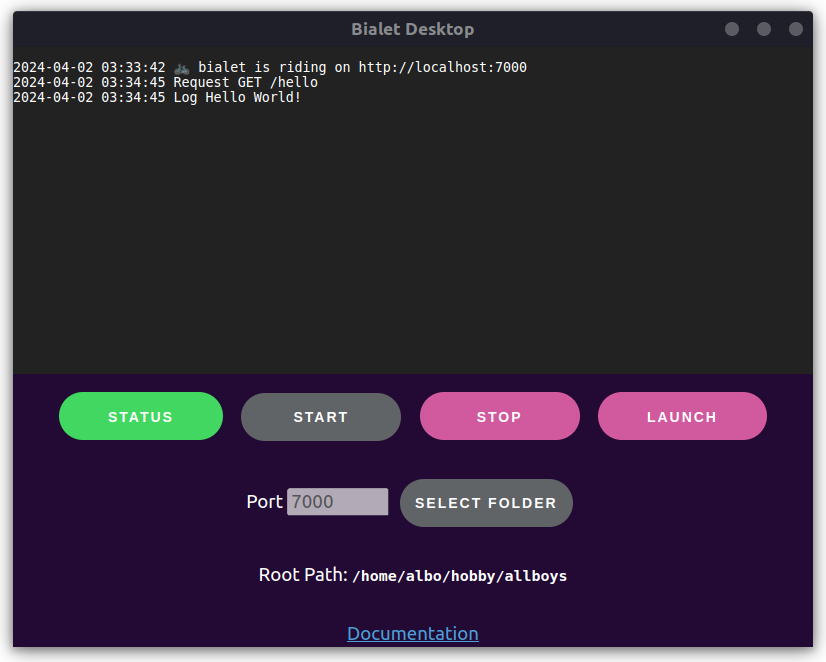

Bialet
======

**Bialet is a full-stack web framework that integrates the object-oriented Wren language with a single HTTP server and a built-in database, creating a unified environment for web development**

.. grid:: 2

    .. grid-item-card::
        :text-align: center
        :link: https://github.com/bialet/bialet/releases/download/v0.4/bialet-desktop_0.1.0_amd64.deb

        :octicon:`desktop-download;2em;sd-text-info`

        Download Bialet Desktop
        +++++++++++++++++++++++
        *for Ubuntu/Debian*

    .. grid-item-card::
        :text-align: center
        :link: https://github.com/bialet/bialet/archive/refs/tags/v0.4.zip

        :octicon:`file-zip;2em;sd-text-info`

        Download source
        +++++++++++++++
        *Use with Docker or compile it*

Quickstart
----------

1. Install Bialet using Docker Compose.

.. code-block:: bash

  git clone https://github.com/bialet/bialet.git
  cd bialet
  docker compose up

2. Visit `localhost:7000 <http://localhost:7000>`_ in your browser.

See :doc:`installation </installation>` for details on building and running the project.

Hello World
-----------

The code is written in `Wren <https://wren.io>`_, though a custom heavily modified
version.

.. code-block:: wren

   import "bialet" for Request, Response

   var name = Request.get("name")

   Response.out('
Hello %( name || "World" )!
')

See more
--------

.. toctree::
   :maxdepth: 2

   self
   installation
   structure
